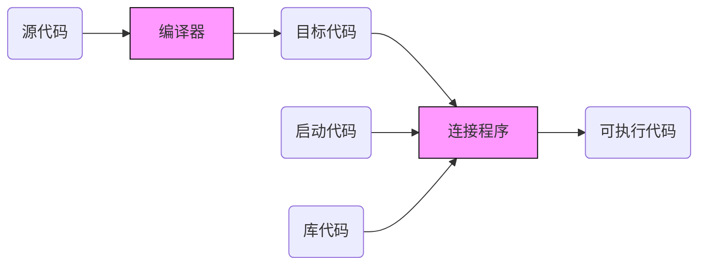
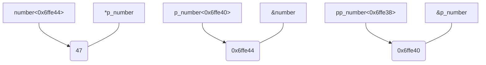
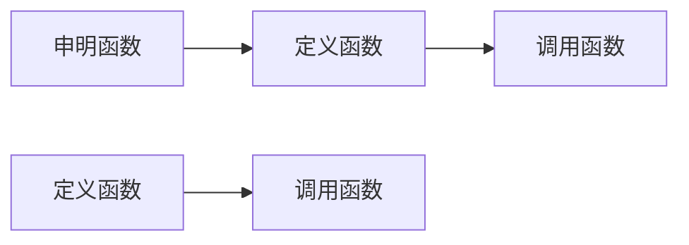

# C C++
---
## 概览
C++ is a general-purpose programming language created by Bjarne Stroustrup as an extension of the C programming language, or "C with Classes". The language has expanded significantly over time, and modern C++ now has object-oriented, generic, and functional features in addition to facilities for low-level memory manipulation. It is almost always implemented as a compiled language, and many vendors provide C++ compilers, including the Free Software Foundation, LLVM, Microsoft, Intel, Oracle, and IBM, so it is available on many platforms.

## link
[offical site](http://www.cplusplus.com/)

### 程序创建步骤

## 基础
### 基本数据类型/操作符
#### 整数类型
+ `bool` 8bit
+ `char` 8bit
+ `short` 16bit
+ `int` 32bit
+ `long` 32bit
+ `long` long 64bit
> 此处只列出常用

#### 浮点类型
+ `float` 32bit
+ `double` 64bit
+ `long double` 128bit
>小数点表示: x.yz .yz
>科学表示: x.yzEn
>16进制: 0xhPo=h*o^p

#### 操作符
+ 运算: `+` `-` `*` `/` `%`
+ 复合赋值: `-=` `*=` `/=` `%=`
+ 按位逻辑: `&` `|` `^` `~`
+ 逻辑复合赋值: `&=` `|=` `^=`
+ 自增/自减: `++` `--`
+ 关系: `<` `>` `<=` `>=` `!=` `==`
+ 移位: `<<` `>>`
+ 圆括号: `()`
+ 特殊的: `sizeof()` `_Alignof()` `_Alignas()`
+ 投射: `(type)`
+ 成员访问: __`.`__`->`

#### 聚合数据类型/自定义类型
+ 枚举: enum id {enum-list,}
```C
//普通枚举
enum SAFE_COLOR
{
    RED,      //0
    GREEN,  //1
    BLUE,    //2
    WHITE=10,  //10
    BLACK,       //11
    YELLOW     //12
}
SAFE_COLOR sc=RED;
//C++11作用域内枚举
enum [class struct] UNSAFE_COLOR{
    RED,      //0
    GREEN,  //1
    BLUE,    //2
    WHITE=10,  //10
    BLACK,       //11
    YELLOW     //12
}
UNSAFE_COLOR usc=UNSAFE_COLOR::RED;
```
+ 结构体: struct id {declar-list;}
> 空结构体占8bit
> __含一个属性时__ 该结构体位宽=属性位宽
> __含N个属性时__ 结构体位宽=N*最宽属性
```C
struct Animal
{
    char name[16];
    int age;
    float tal;
    float weight;
}
```
+ 联合体: union id{declar-list;}
```C
union Number
{
    int int_number;
    float float_number;
    char char_number;
}
```
+ 位域: type id : width;
> 位域是 __在结构体/联合中__ 指定位宽的成员,常用来 __抽象数据流__ 必须是 __整数类型__
> 位域分割一个字节为若干段，超出部分放在下一个字节,移植性弱
```C
struct field_struct
{
    int i_4b : 4;
    int : 2; <--匿名位域，用\0填充2bit，不能被访问
    int i_2b2 : 2;
    int i_8b : 8;
}
```
+ 数组: type id[size]
```C
char chs[]={'H','e','l','l','o'};<--初始化字符数组
char str[]={'H','e','l','l','o','\0'};<--初始化字符串
char strx[]="Hello";<--字符串字面变量初始化字符数组==char str[]={'H','e','l','l','o','\0'};
const char* stry=en"Hello";<--en代表编码格式
const char* styz="h" "e" "ll" u"o";<--字符串拼接特性
```

### 指针
__指针操作__
> 申明指针: `type` *p_id | `type*` p_id |type`*p_id`
> 地址操作符: &
> 间接操作符: *
> 取指针指向对象的成员用 `->` 操作符
```C
int number=47;
int *p_number;<-- 一级指针
p_number=&number;
int **pp_number;<-- 多级指针
pp_number=&p_number
```

#### 数组与指针
>__数组__ 可看作一个 __指向数组第一个元素__ 的指针
>操作下标实则是操作指针char[x]==*(char+x)
```C
char greet[]={'H','e','l','l','o'};
int len=typeof(greet)/typeof(greet[0]);
for(i=0;i<len;i++){
    printf("%c",greet[i]);//操作下标
    printf("%c",*(greet+i));//操作指针
}
```
>屏幕打印: HHEELLOO
>证明: 数组是内存连续的(在栈区)，其指向数组第一个元素的地址

#### void与指针
>申明void指针对象: void* p_id;
>void指针特性: void指针可以指向任何数据类型
>void特性: 任何数据类型可投射为void类型
>特殊的:void *p_id=NULL,表示无效指针,防止`野指针`

```C
void* p_ether;
int i_number;
float f_number;
struct {}s;
...
p_ether=&i_number;
p_ether=&f_number;
p_ether=&s;
```
###  函数
__分类__
+ 有返回值
+ 无返回值

__使用过程__
>调用非本scop的资源需要引入头文件

```C
void fun(); <--declare
void fun(){} <--define
int main(int argc,char** argv){
    fun(); <--cal
    return 0;l
}
```
__参数为数组的情况__
```C
void fun(int* args){
    
}
int numbers[]={1,2,3,4};
fun(int);
```
>数组参数被隐式转换为指针，指向数组第一个元素

__不定参数的情况__
>引入<stdarg.h>

`type` fun_name(known arg0,`...`)
__内联函数__
`inline` fun_name()
__函数指针__
type (* [cv]) (paras-list)
```C

int add(int x,int y){
    return x+y;
}
int main(int argc,char** argv){
    int (*p_add)(int x,int y)=&add;<-- 指向add的函数指针p_add
    return 0;
} 
```
__main函数__
```C
int main(void);
int main(int argc,char** argv);
```
>argc:参数列表参数个数
>argv:参数列表数组指针

#### 函数模板
template /<typename T/>
void fun(T &a,T &b)
```C
// function prototype
template <typename T>
void fun(T &a,T &b);
// function define
template <typename T>
void fun(T &a,T &b){
    T  temp;
    temp=a,
    a=b;
    b=temp;
}
//call fuction
void caller(){
    int a=10;
    int b=20;
    fun(a,b);
}
```

### 预处理器
+ 宏定义
``` C
#define <macroId> [replace-list] \n
#define <macroFunId> [replace-list] \n
+ 源文件包含预处理指示符
#include ""
#include <>
+ 条件预编译
definde(macroId)
#if
#elif 
#else
#endif
```
+ error line undef pragma
### 面向对象
#### 类
`class` className{};
>类定义于头文件
>类声明于源文件
>类作为对象的模板，用于属性封装
```C
class Demo{
    //type attrName;
    int attr1;
    struct attr2;
    ...
    //type methodName();
    int getAttr1();
    struct getAttr2();
    ...
}
```
#### 类和结构体
+ 关键点
>缺省成员访问权限: __类__ 为`private`，__结构体__ 为`public`
>__类__ 可以继承 __结构体__
>__结构体__ 可以继承 __类__
>都可以使用模板

**模板类**
template /<typename T/>
class clazz/<T/>
```C
//propotype
template <typename T>
class clazz<T>{
public:
    int index;
    T container[MAX];
    void add(T &item);
}
//define
template <typename T>
clazz<T> :: add(T &it){
    index++;
    container[index]=it;
}
```
#### 继承
class sub: [permission] super
```C
class clazz{};
class sub_clazz : clazz{};
```
参考文献：
[《C++ primer plus》](https://www.amazon.cn/dp/B008A4XZRI/ref=cm_sw_r_si_2_dp_8.G.Cb5W0K1ZX
)
[《C编程魔法书》](https://www.amazon.cn/dp/B072J9GMVL/ref=cm_sw_r_si_2_dp_8bH.CbWBE31FB)